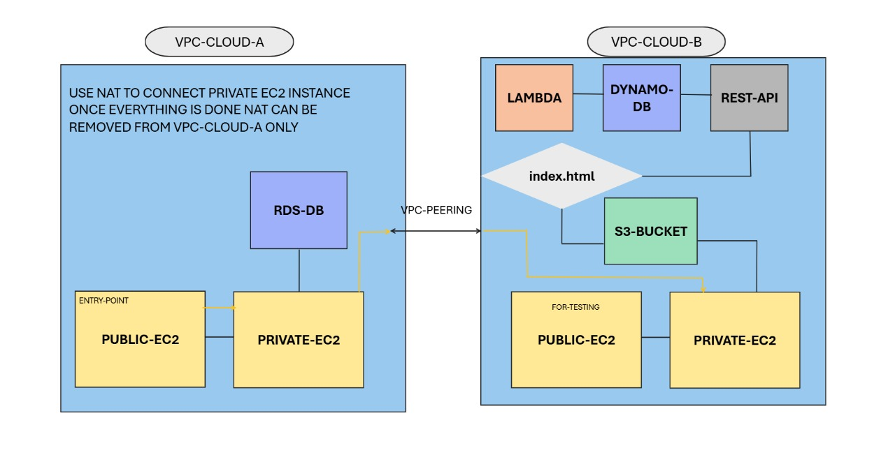

# AWS-Multi-VPC-Architecture
Multi-VPC architecture with Login &amp; Employee Registration apps connected via VPC Peering on AWS
[README.md](https://github.com/user-attachments/files/22323428/README.md)
# AWS Multi-VPC Architecture Project

## 📌 Overview
This project demonstrates a **multi-VPC setup on AWS** where two different applications communicate securely across VPCs.  

- **VPC 1** hosts a **Login Application** with a backend RDS database.  
- **VPC 2** hosts an **Employee Registration Application** with its own resources.  
- The VPCs are connected using **VPC Peering** to enable secure communication between applications.  

This architecture is designed to simulate a **real-world enterprise setup** where multiple applications run in isolated environments but still share data when required.  

---

## 🏗️ Architecture Diagram
  

---

## ⚙️ Components Used
- **VPCs & Subnets** → Public & private subnets for separation of resources.  
- **EC2 Instances** → Hosting applications.  
- **RDS (MySQL/PostgreSQL)** → Backend database for Login app.  
- **Security Groups** → Controlled inbound/outbound traffic.  
- **IAM Roles** → Secure access to resources.  
- **S3 Bucket** → Static asset storage.  
- **VPC Peering** → Connectivity between Login App and Registration App.  
- **Internet Gateway & NAT Gateway** → Public access and private resource updates.  

---

## 🚀 Steps to Deploy
1. **Create VPCs**  
   - VPC1 for Login App, VPC2 for Employee Registration App.  
   - Add public/private subnets.  

2. **Launch EC2 Instances**  
   - Install required web applications (Login & Employee Registration).  
   - Configure web server (Apache/Nginx).  

3. **Configure RDS**  
   - Launch RDS instance inside VPC1.  
   - Connect Login app to RDS using private endpoint.  

4. **Setup VPC Peering**  
   - Establish peering connection between VPC1 & VPC2.  
   - Update route tables to allow cross-VPC traffic.  

5. **IAM & Security Groups**  
   - Create IAM roles for EC2 & RDS access.  
   - Configure SGs to allow app ↔ DB communication.  

6. **Testing**  
   - Access Login App → verifies RDS connectivity.  
   - Access Registration App → verifies VPC peering communication.  

---

## 🔍 Key Learnings
- How to design **multi-VPC architectures** for isolation and security.  
- Hands-on practice with **RDS, EC2, VPC Peering, IAM, Security Groups**.  
- Understanding how applications in separate VPCs interact securely.  

---

## 📂 Repository Contents
- `CODES/` → Scripts/configuration snippets used.  
- `INSTRUCTIONS/` → Step-by-step deployment notes.  
- `Architecture_diagram.jpg` → Architecture diagram.  

---

## 📌 Next Steps
- Automate the same architecture using **Terraform**.  
- Add a **CI/CD pipeline** to auto-deploy web apps.  
- Explore connecting additional services (e.g., Lambda, CloudFront).  
